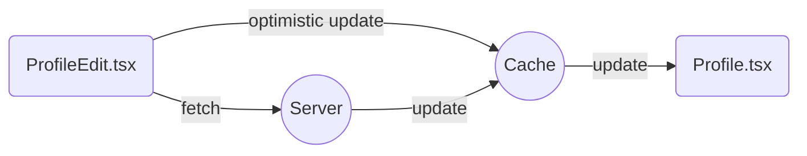

import Alert from "../../../components/TailwindUI/Alert";

# Sending Mutations

Mutations are created via the `useMutation()` hook.

Think of `useMutation()` as a specialized version of `useQuery()`, where queries
do not immediately trigger upon render, instead you invoke mutations in response
to user interactions.

```graphql filename="schema.graphql"
type Mutation {
  updateProfile(name: String!): User!
}
```

```tsx {15} filename="src/ProfileEdit.tsx"
import { useMutation } from "../gqty";

export default function ProfileEdit() {
  const [mutation, { isLoading }] = useMutation();

  return (
    <form
      onSubmit={(e) => {
        e.preventDefault();

        const user = mutation.updateProfile({
          newName: e.target.name.value,
        });

        user.id; // Don't forget to make selections
      }}
    >
      <input type="name" name="name" />
      <button type="submit" disabled={isLoading}>
        Save
      </button>
    </form>
  );
}
```

<Alert className="mt-5" severity="info" title="Don't forget to make selections">
  Mutations will not fire if you stop at `updateProfile()` for it is an
  incomplete GraphQL query, at least select one field.
</Alert>

## Fragments

**Fragments** is an important concept in GraphQL, they are especially emphasized
in Relay. It declares reusable units in GraphQL for shared use amongst
components, while retaining the ability to be combined into one single fetch.

In GQty you enjoy the same benefit without having to manage fragments yourself,
individual selections are managed and combined automatically while rendering.

```tsx {3,10,22} filename="src/ProfileEdit.tsx"
import { useState } from "react";
import { useMutation, Mutation } from "../gqty";
import Profile from "../components/Profile";

export default function ProfileEdit() {
  const [mutation, { isLoading }] = useMutation();
  const [user, setUser] = useState();

  if (user) {
    return <Profile user={user} />;
  }

  return (
    <form
      onSubmit={(e) => {
        e.preventDefault();

        const user = mutation.updateProfile({
          newName: e.target.name.value,
        });

        setUser(user);
      }}
    >
      <input type="name" name="name" />
      <button type="submit" disabled={isLoading}>
        Save
      </button>
    </form>
  );
}
```

Notice the `<Profile />` component used above, it is the same component when
visiting the profile page. Because the component already has all the skeleton
loading state in place, you don't have to care about what selections to make.

<Alert className="mt-5" title="Reuse query components">
  Reusing loading states for the read component helps you make exactly the same
  selections it needs when users visit again. This makes sure the cache is
  fresh, complete and consistent.
</Alert>

## Optimistic Updates

Optimistic updates in GQty is as simple as value assignments.

```tsx
user.name = newName;
```

Remember that you are directly interacting with the cache, GQty is managing
selections on the side and nothing is stopping you from changing cached values.

You may even use `Object.assign()` to perform optimistic update on the whole
object.

```tsx
Object.assign(user, {
  firstName: firstName,
  lastName: lastName
  email: newEmail,
});
```

This chart shows the flow of data when performing optimistic updates.



<Alert className="mt-5" title="Always refetch on errors">
  Successful mutations will overwrite your changes with new data, while failed
  mutations leaves the cache as-is. You should always refetch on failure to
  reflect the current state of data.
</Alert>

## Suspense

In Suspense mode, the `useMutation()` hook allows you to pass a selection
function as the first argument. It is a good idea to reuse the prepare function
from related query components here.

```tsx {2,9,11,19} filename="src/ProfileEdit.tsx"
import { useMutation } from "../gqty";
import { prepare } from "./Profile";

export default function ProfileEdit() {
  const [updateProfile, { isLoading }] = useMutation(
    (mutation, inputs) => {
      const user = mutation.updateProfile(inputs);

      prepare(user); // Reuse the same `prepare` function from queries
    },
    { suspense: true }
  );

  return (
    <form
      onSubmit={(e) => {
        e.preventDefault();

        await updateProfile({ newName: e.target.name.value });
      }}
    >
      {/* form controls ... */}
    </form>
  );
}
```

You can read more about Suspense on queries [here](./read#suspense).

## Refetching

Sometimes it is more convenient to simply refetch a few related queries rather
than meticulously craft shared components to ensure cache updates are correctly
propagating through normalized objects.

Post-mutation refetching can be done via `onError()` and `onComplete()` options.

```tsx filename="src/ProfileEdit.tsx"
import { resolve, useMutation } from "../gqty";
import { prepare } from "./Profile";

export default function Component() {
  const [mutation, { isLoading }] = useMutation({
    onComplete() {
      await resolve(({ query: { me } }) => prepare(me), {
        cachePolicy: "no-cache",
      });
    },
  });
}
```

Due to the imperative nature of such callbacks, the core function `resolve`
should be used in place of hooks.
